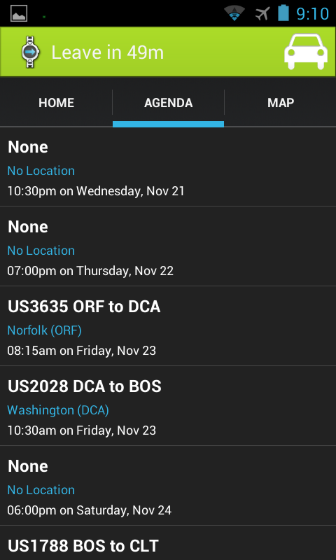
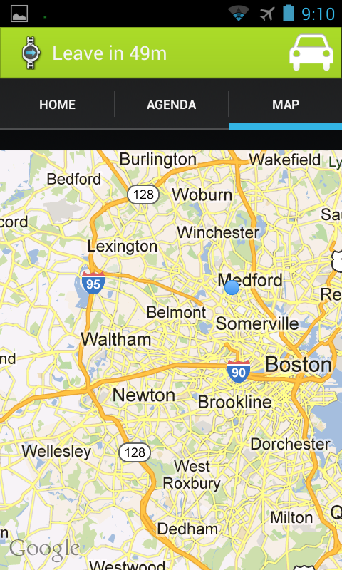
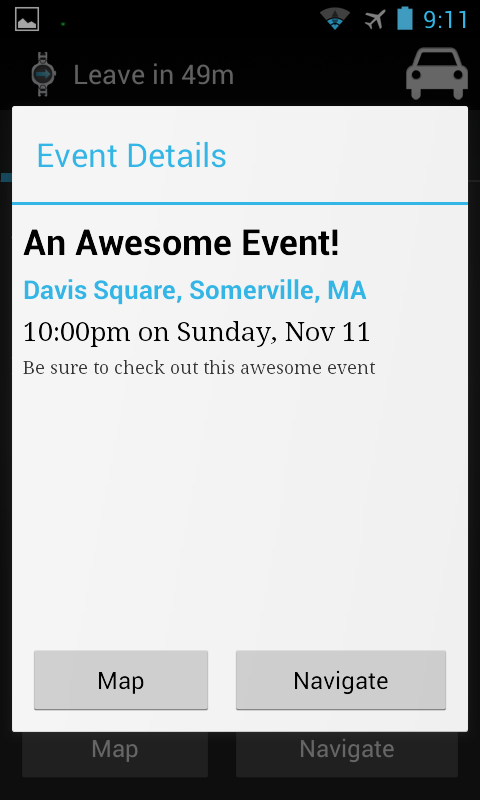

# WhenToLeave

WhenToLeave is an Android app that ties into a user's calendar and provides alerts and notifications on when to leave based upon the user's location, transit options, and traffic.

## Repo
Note: This app was originally developed at:

[http://code.google.com/p/csci588-project/](http://code.google.com/p/csci588-project/)

## Virtual Device Setup

Target: Google APIs (Google Inc.) - API Level 8
Skin: Built-in WVGA854

### Google Account & Calendar Accounts

To add a Google account to your virtual device: start it, go Settings (in the application list), click "Accounts & Sync", click Add account, select Google, then sign into your google account.

### GPS

Note that many of the features of the application require a GPS signal. To send a GPS signal to a virtual device, use the DDMS application included in the Android SDK Tools.

### Aditional Screenshots

